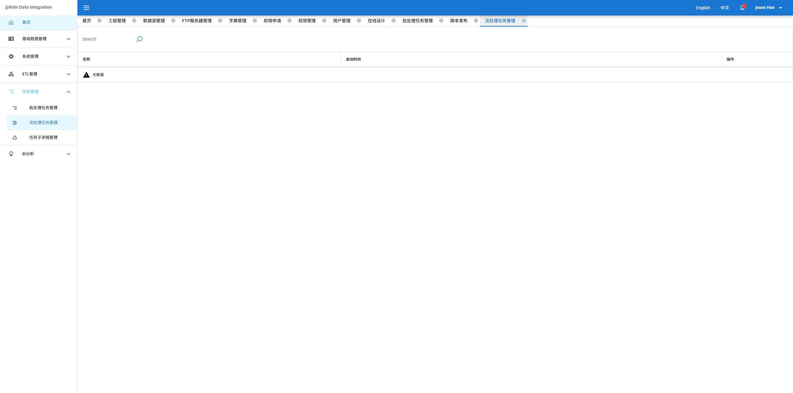

# ETL CLIENT (client)

etl client

## Install the dependencies
```bash
yarn
# or
npm install
```

### Start the app in development mode (hot-code reloading, error reporting, etc.)
```bash
quasar dev
```


### Lint the files
```bash
yarn lint
# or
npm run lint
```

### Build the app for production
```bash
quasar build
```

### Customize the configuration
See [Configuring quasar.conf.js](https://v1.quasar.dev/quasar-cli/quasar-conf-js).

# Nxin Data Integration # 

数据集成专业软件，包含ETL数据处理、数据看板；

ETL数据处理模块基于Kettle二次开发，重写50余种常用组件，

支持关系型数据库、NoSQL数据库、网络服务、文件操作等，

可视化设计实现数据或流的提取、转换、加载全流程化处理。

数据看板模块支持模型元数据定义、报表在线设计及在线排版布局，可为不同业务提供丰富的数据统计分析。

## 体验地址

    http://132.232.194.157
  * 用户名：jesse.18@163.com
  * 密码：123456

**请勿修改密码**

## 工程结构

* **interface:**
  提供web-server与worker集群通信所依赖的数据结构
* **kettle-export:**
  依赖Pentaho Data Integration的jar包及数据库驱动包
* **web-server:**
  在线设计服务集群
* **worker:**
  任务调度集群，实现ETL执行及其他定时任务
* **client:**
  前端客户端页面，前端工程地址：https://gitee.com/team-designer/etl-designer-client

构建及部署
--------------

系统使用MySql数据库，数据库初始化执行init.sql及quartz.sql

Java工程使用Maven命令构建

前端工程使用Nodejs命令构建


## 环境要求
* Maven, version 3+
* Java JDK 8
* Nodejs v10+（除11，13）

## 开发

系统强依赖的中间件，在application.yml文件中需要根据实际情况设置
* 数据源

  * web-server与worker共用同一个数据源(spring.datasource)
  * etl执行日志可与web-server/worker使用同一个数据库，也可单独配置独立数据源(etl.log.datasource)
* redis

  * 存储找回密码的验证码
  * web-server与worker间推送控制指令的通道，可使用其他消息中间件替代(ActiveMQ，RabbitMQ等)
* mail

  * 发送密码找回邮件
* sftp

  * etl脚本创建后，web-server服务会将脚本推送至sftp服务器，用户需提供一个可用的sftp服务，将地址/用户名/密码设置在vfs信息描述中

## 编译

后端基于Maven的工程结构，使用下面命令编译

```
$ mvn clean install -DskipTests
```

前端基于Nodejs的工程结构，使用quasar V1( https://quasar.dev ) 命令编译

配置【client】工程quasar.conf.js文件中build.env.API,设置开发环境及正式环境后端域名

```
$ quasar build
```

开发环境使用如下命令编译

```
$ quasar dev
```

## 部署

修改【web-server】工程属性文件application.yml中worker的地址，替换为正式环境集群地址

* worker.schedule-create-job-uri 创建批处理调度任务
* worker.schedule-find-all-cron-trigger-uri 查询所有批处理调度任务
* worker.schedule-pause-uri 暂停批处理调度任务
* worker.schedule-stop-uri 下线【批/流】处理任务
* worker.schedule-resume-uri 恢复批处理调度任务
* worker.schedule-modify-uri 修改批处理任务配置
* worker.schedule-create-streaming-uri 创建流处理任务


## 功能简介

###  基础数据

####  工程管理

一切业务处理的顶端入口，ETL脚本的设计、发布、回滚等，数据看板相关业务的设计等都需要先有工程模块，

同时工程模块可绑定使用者，用户经绑定后可以看到同模块下的数据源、服务器信息、ETL脚本数据及数据看板信息


####  数据源管理

所有ETL运行时依赖的数据库、数据看板依赖的数据库均在本模块下维护，系统自带支持MySql，Oracle，PostgreSql，支持用户扩展其他数据库产品


####  FTP服务器管理

所有ETL运行时依赖的FTP服务器，均在本模块下维护，例如导出的excel、csv数据等


####  字典管理

系统运行时依赖的配置数据


###  系统管理

####  权限申请

用户通过权限申请功能，可加入其他工程模块，访问工程下的敏感资源（包含数据源、服务器、报表等，注：任何工程下的敏感资源，需再次申请资源的操作权限），权限申请有过期限制，超期后，权限会自动回收


####  权限管理

资源所有者可主动添加资源的访问者及访问级别（读/读写）


####  用户管理

新增及维护用户


###  ETL管理

####  在线设计

用户通过可视化设计模块，完成ETL转换及任务的在线开发及调试，并将脚本更新为可发布状态

#####  目录管理

通过创建目录，将同意业务的多个脚本文件聚合在一起


#####  Trans(转换)设计

数据转换的核心组件，用于对数据进行清洗、转换和整合

是ETL工具的核心功能模块，通过定义多个步骤（Step）实现复杂的数据处理流程


#####  Job(任务)设计

用于定义整个数据处理流程的高级组件，包含多个作业项（Job Entry），可控制转换的执行逻辑和调度任务

通过图形化界面整合多个转换步骤（Transformation），支持定时执行、日志监控等功能，实现复杂的数据处理流程自动化


####  脚本调试

通过调试日志，可以发现并处理设计过程中的缺陷，为数据处理提供质量保障


####  脚本发布

用户通过该模块，可将“可发布“状态的脚本完成发布操作，发布动作完成后，【worker】工程会根据设定的执行频率定时执行ETL过程


###  任务管理

通过采集【worker】集群执行的任务清单，按照批或流分类进行管理

####  批处理任务管理

任务被【worker】工程调度执行后，用户可在该模块查看任务的执行情况，包括执行日志，调度时间等信息，并可在该模块对任务操作暂停、下线等


<br/>
<br/>


####  流处理任务管理

该模块功能与【批处理任务管理】相同，唯一区别为该模块管理的为实时数据处理，即任务进程为阻塞式执行，实时等待处理通过消息队列传输的数据



####  任务子进程管理

任务执行出现CPU或内存异常，需要终止任务时，可在该模块进行操作，该操作仅终止正在执行的当次任务，不影响后续任务的调度


###  BI分析

####  报表图形

集成Apache Echarts组件，提供饼状图、柱状图、折线图、散点图等图形模板，为不同业务提供图形支持

####  模板设计

使用freemarker脚本语言，生成echarts图形所必须的配置项


###### 配置说明
  * 模板编辑
    ```
    {
      "legend": {},
      "tooltip": {},
      "title": {
      "text": "${title['text']}",
      "left": "${title['left']}",
      "top": "${title['top']}"
      },
      "dataset": {
      "dimensions": [<#list dimensions as dim>"${dim}"<#if dim_has_next>,</#if></#list>],
      "source": [<#list source as row>{<#list row?keys as key>"${key}": "${row[key]}"<#if key_has_next>,</#if></#list>}<#if row_has_next>,</#if></#list>]
      },
      "xAxis": {"type": "category"},
      "yAxis": {},
      "series": [<#list dimensions as dim><#if dim_index gt 0>{ "type": "bar" }<#if dim_has_next>,</#if></#if></#list>]
    }
    ```
  * 经过模板转移后生成echarts标准模板
    ```
    {
      "legend": {},
      "tooltip": {},
      "title": {
      "text": "2015到2017年产品销售报表",
      "left": "center",
      "top": "bottom"
      },
      "dataset": {
      "dimensions": ["product","2015","2016","2017"],
      "source": [{"product": "Matcha Latte","2017": "93.7","2016": "85.8","2015": "43.3"},{"product": "Milk Tea","2017": "55.1","2016": "73.4","2015": "83.1"},{"product": "Cheese Cocoa","2017": "82.5","2016": "65.2","2015": "86.4"},{"product": "Walnut Brownie","2017": "39.1","2016": "53.9","2015": "72.4"}]
      },
      "xAxis": {"type": "category"},
      "yAxis": {},
      "series": [{ "type": "bar" },{ "type": "bar" },{ "type": "bar" }]
    }
    ```
  * 模板参数赋值
    ```
    {
      "title": {
        "text": "2015到2017年产品销售报表",
        "left": "center",
        "top": "bottom"
      },
      "dimensions": ["product", "2015", "2016", "2017"],
      "source": [
        { "product": "Matcha Latte", "2015": 43.3, "2016": 85.8, "2017": 93.7 },
        { "product": "Milk Tea", "2015": 83.1, "2016": 73.4, "2017": 55.1 },
        { "product": "Cheese Cocoa", "2015": 86.4, "2016": 65.2, "2017": 82.5 },
        { "product": "Walnut Brownie", "2015": 72.4, "2016": 53.9, "2017": 39.1 }
      ]
    }
    ```
  * 其他图形配置请直接访问 http://132.232.194.157/#/bi-chart
######  预览

在样例数据处填入演示数据，完成图形预览操作，方便报表设计套用时，直观的展示图形


####  模型管理

提供模型元数据维护及模型转成数据库表的功能，通过规范的元数据设计，降低用户进行数据统计分析时的难度


模型转换为数据库表，生成DDL：


####  报表设计

通过该模块，用户可将统计模型通过合适的图形模板展现出来，并可在线预览


在线预览:


####  布局管理

通过该模块，用户可任意选择多个报表自由组合拼装成数据看板页面，并通过生成的URL在线阅览


用户可自由缩放、拖拽报表大小及位置，最终组合成完成的数据看板

####  数据看板

访问由布局管理模块生成的看板URL，可实时查看报表数据


##  技术架构图


###  二次开发

#### 开发依赖

* redis

  缓存找回密码的动态验证码

  为web-server与worker通信提供管道服务

* ftp服务

  需连接ftp服务器，用于存放etl运行的脚本，worker执行脚本时，会从ftp服务器拉取最新文件

  windows开启ftp/sftp功能：安装openSSH工具，下载地址：https://github.com/powershell/win32-openssh/releases 或https://pan.baidu.com/s/12TCh9a3YevUOpVLVrx2VWg?pwd=65xh

  macos开启ftp/sftp功能：https://blog.csdn.net/King_zj/article/details/125991856

####  数据库支持

* 在字典管理中，找到数据源字典项，将需要支持的数据源在此进行维护
* 在kettle-export工程引入驱动包

通过以上两步即可完成新增数据源的支持

####  KETTLE组件

* web-server工程，在com.nxin.framework.converter.kettle包下，根据新增组件的类型，选择job或transform目录添加新的插件责任链，并在TransformConvertFactory.java或JobConvertFactory.java类中进行注册
* client工程，在component\etl目录下，根据新增组件的类型，选择job或transform目录添加新的插件表单vue文件，并在pages\etl\CanvasCom.vue文件中引入该vue文件，并在components集合中注册该插件

##  联系方式
* 邮箱 

  jesse.18@163.com

* 微信 

  

## ROOT账号及密码

用户名: jesse.18@163.com

密码: 123456